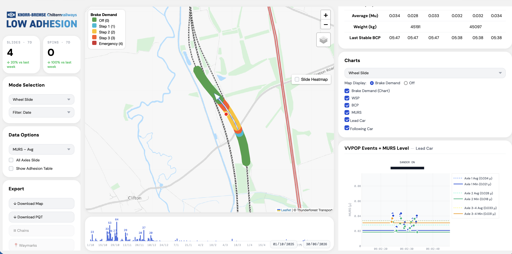

# Low Adhesion Map

[](https://www.python.org/)
[](https://fastapi.tiangolo.com/)
[](https://leafletjs.com/)
[]()

Interactive railway telemetry dashboard for investigating low wheel-rail adhesion events. This student portfolio project focuses on the map-based analysis layer: querying processed train telemetry, grouping events, enriching them with railway and environmental context, and presenting the results in a browser UI.

> **Note on confidentiality:** Confidential Knorr-Bremse calculation logic and protected implementation details have been redacted. Public railway concepts, Network Rail context, weather/elevation APIs, and general software engineering approaches remain visible. See [Public Redaction Notice](#public-redaction-notice) for specifics.



## Table of Contents

- [Overview](#overview)
- [Problem](#problem)
- [Features](#features)
- [Technical Architecture](#technical-architecture)
- [Technologies Used](#technologies-used)
- [My Contribution](#my-contribution)
- [Getting Started](#getting-started)
- [Relationship Between Projects](#relationship-between-projects)
- [Public Redaction Notice](#public-redaction-notice)

## Overview

Low Adhesion Map is a FastAPI and JavaScript web application for exploring wheel slide, wheel spin, emergency brake, and train stop events. It combines telemetry from Snowflake with route context, chainage data, weather, elevation, brake-performance summaries, and MURS adhesion indicators.

The purpose is to help engineers move from raw telemetry records to event-level insight: where an event happened, what the train was doing, and what contextual data may help explain it.

## Problem

Low adhesion between wheel and rail can affect braking performance, train handling, timetable reliability, and maintenance investigation. Raw train telemetry is high-volume and difficult to interpret directly, especially when events need to be related to location, weather, gradient, train formation, and axle-level behaviour.

This project turns processed telemetry into interactive event records that can be inspected spatially and through time-series charts.

## Features

- Interactive Leaflet map showing low-adhesion railway events
- Event filtering by route, train, event type, date range, and MURS display mode
- Event clustering from timestamped telemetry points
- Right-side event detail panel with chainage, weather, elevation, train orientation, brake performance, and axle summaries
- Time-series charting for speed, brake pressure, WSP activity, and MURS signals
- GeoJSON overlays for railway context, including waymarks, chain information, speed-change markers, and track-gradient areas
- Export/download support for portable event review outputs
- Public placeholder for confidential derived-MURS logic while preserving the surrounding data flow

## Technical Architecture

```text
Snowflake telemetry
        |
        v
FastAPI backend
  - event queries
  - timestamp clustering
  - route/router pairing
  - MURS cleaning and smoothing
  - weather, elevation, chainage enrichment
  - cached API responses
        |
        v
Frontend dashboard
  - Leaflet map
  - filters and timeline controls
  - event detail panel
  - telemetry charts
```

**Backend**

| Path | Description |
|---|---|
| `backend/main.py` | FastAPI entry point and static/frontend mounting |
| `backend/app/api/` | API routes for event data and downloads |
| `backend/app/services/fetcher.py` | Core event query, clustering, enrichment, and response assembly pipeline |
| `backend/app/services/weather.py` | Open-Meteo historical weather integration |
| `backend/app/services/elevation.py` | OpenTopoData elevation lookup |
| `backend/app/services/murs.py` | Public MURS cleaning and smoothing utilities |
| `backend/calc_murs.py` | Public placeholder for redacted derived-MURS calculation logic |
| `backend/app/db/snowflake.py` | Snowflake connection setup using redacted local configuration |

**Frontend**

| Path | Description |
|---|---|
| `frontend/index.html` | Dashboard layout |
| `frontend/styles.css` | Dashboard styling |
| `frontend/app.js` | Application bootstrap |
| `frontend/js/map/` | Map setup, event rendering, overlays, heatmap, chain and speed layers |
| `frontend/js/panel/` | Event information and chart rendering |
| `frontend/data/` | Public/static GeoJSON and JSON context layers |

## Technologies Used

- Python
- FastAPI
- Pandas
- Snowflake Connector for Python
- Vanilla JavaScript
- Leaflet
- Browser-based chart rendering
- HTML/CSS
- GeoJSON
- Open-Meteo historical weather API
- OpenTopoData elevation API
- Network Rail / public railway context data

## My Contribution

This project demonstrates student software engineering work across backend, frontend, data processing, and geospatial visualisation:

- Designed the event-analysis backend structure around focused service modules
- Implemented event clustering and enrichment flow from telemetry query results to dashboard-ready records
- Integrated public weather, elevation, and railway context data into event summaries
- Built an interactive map UI with filters, overlays, event details, and chart panels
- Organised MURS and axle-level summaries for inspection while redacting confidential calculation details
- Prepared the repository for public portfolio review by removing secrets, generated files, and protected Knorr-Bremse-specific logic

## Getting Started

### Prerequisites

- Python 3.x
- Access to a Snowflake instance (real telemetry) — optional for exploring the UI/code structure only

### Backend

```bash
cd backend
python -m uvicorn main:app --reload
```

### Frontend

```bash
cd frontend
python -m http.server 3000
```

Then open [`http://localhost:3000`](http://localhost:3000).

> Local Snowflake configuration is required to run against real telemetry. The committed configuration values are redacted placeholders, so the app will not connect to live data out of the box.

## Relationship Between Projects

This repository is part of a larger low-adhesion analysis system. It represents the dashboard and event-analysis application.

The companion repository, [`low_adhesion_decoder`](https://github.com/piotresh/low-adhesion-decoder), contains the telemetry ingestion and decoding pipeline that converts raw router JSONL files into structured Snowflake records used by this map application.

## Public Redaction Notice

This public portfolio version keeps the project context and engineering approach visible while protecting confidential company details. Redacted items include:

- Snowflake credentials and private key material
- Exact proprietary CAN decoding maps
- Derived-MURS calculation logic
- Derived mass/weight calculation logic